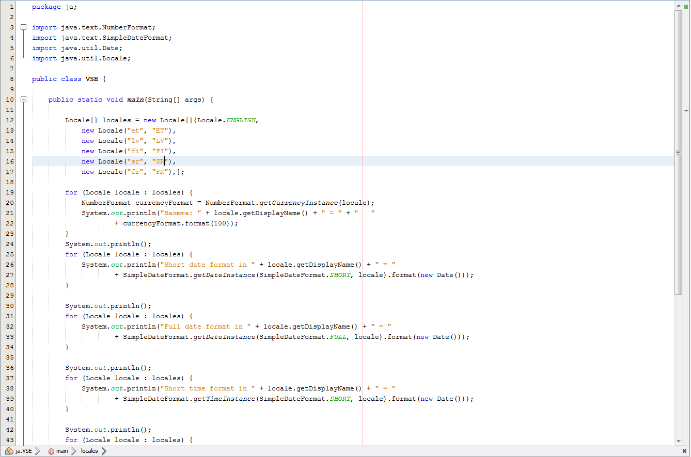
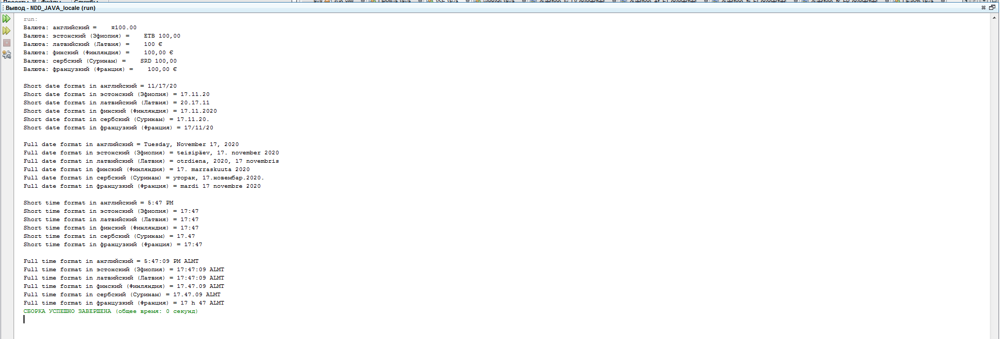
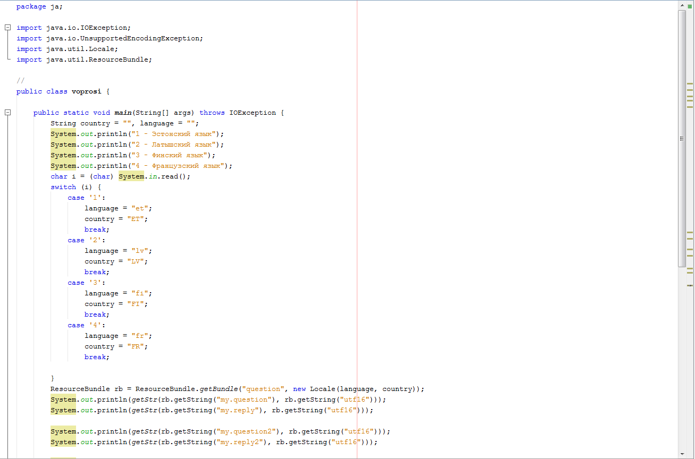
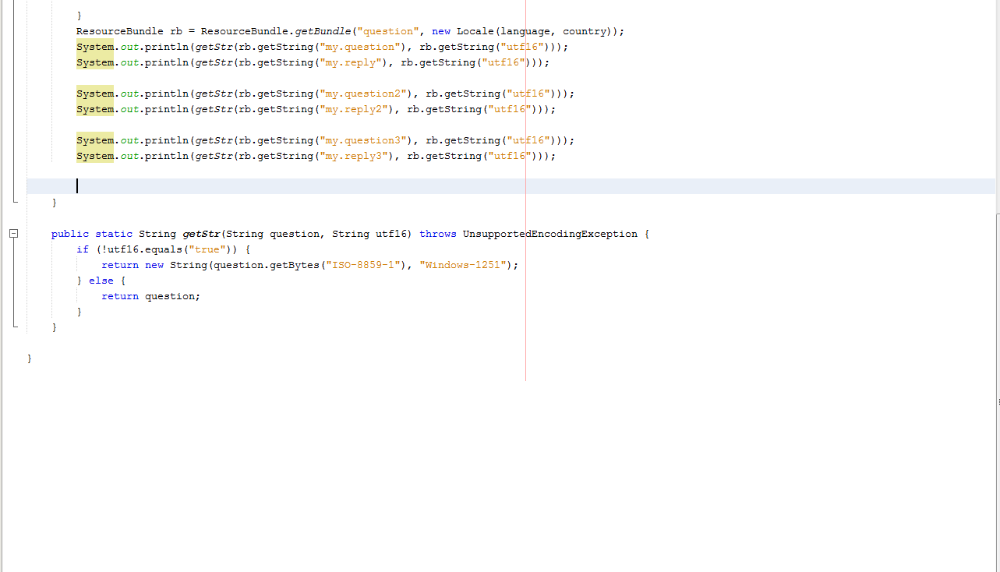
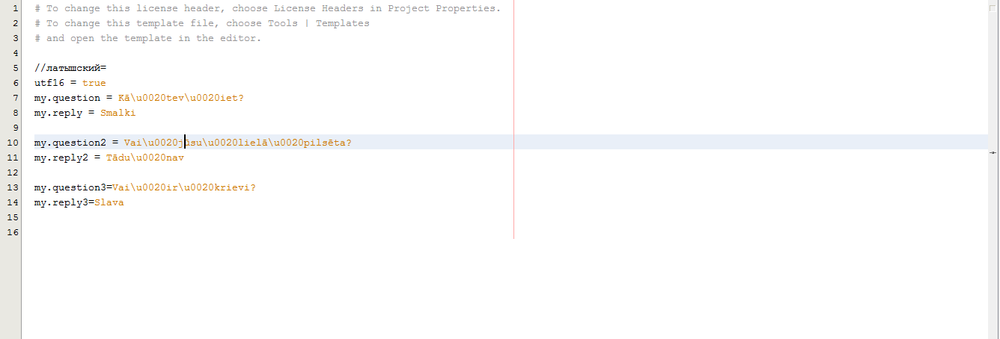
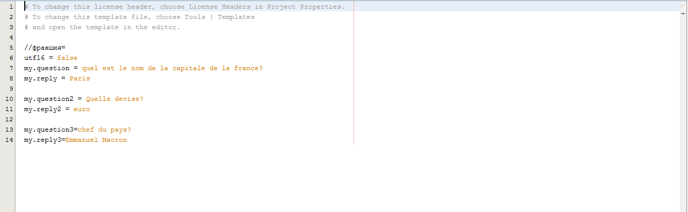
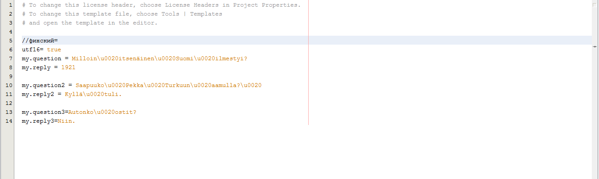
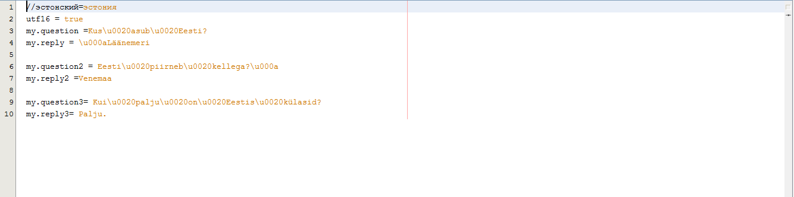
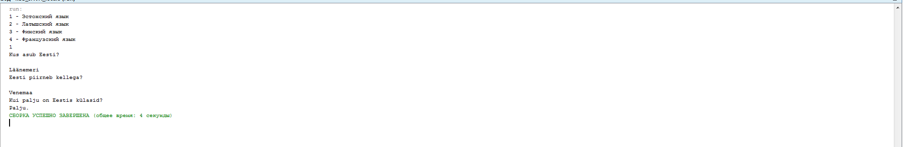

# praktika6
| Фамилия, имя студента | Группа    | Дисциплина  |Тема                              
| --------------------- |:---------:| ------------|:--------------------------------:|
| Федоренко Виталий     | ИС-302    | ООП         |6. Интернационализация приложений |

1-я программа VSE, вней записано время, валюта, число, год,месяц. Cкриншоты программы и вывода: 

2-я программа voprosi, в ней записаны различные вопросы, ответы на разных языках мира. Скриншот программы и вывода:

